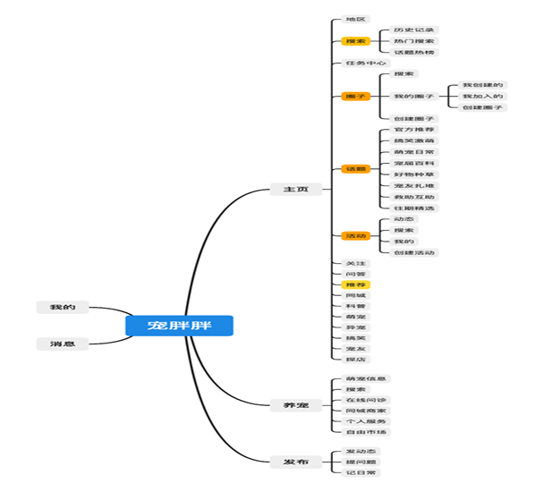
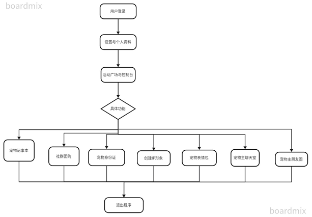
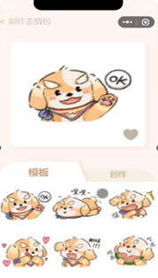
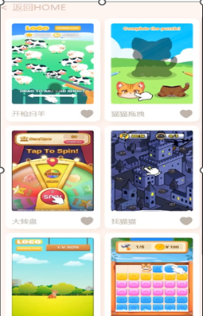

## 团小萌是一个结合宠物用品团购、虚拟宠物形象 IP 以及问答社区的智能化一站式养宠平台。 
## 本产品主要包含以下功能： 
### 1. 基于宠主在购买宠物用品，特别是狗粮时存在“选择难”的问题，团小萌可以通过用户输入的宠物年龄、品种、体型等特征信息应用大数据检索技术智能推荐合适的产品。 
### 2. 基于精细化养宠的市场现状，团小萌通过提供大规模的宠物食品配方可视化功能，为用户团购决策提供更多的选择和保障。用户可以通过智能推荐系统跳转至团小萌团购平台，该平台提供单买和拼团两种模式，考虑到大多数养宠用户在购买宠物用品特别是服饰时存在“冲动消费”“学习模仿”心理，因此通过奖励机制鼓励用户将团购链接分享至亲朋好友或者由团小萌经营的“品类团购社群”和“地区团购社群”，以求扩大销量和提高品牌知名度。 
### 3. 基于养宠人士快速增长带来广阔的市场前景以及养宠人士经验不足宠物咨询难等显著的市场缺口，团小萌通过提供宠物问答社区，使用户可以在平台自由发问与宠物相关的疑惑并激励养宠人士的解答，同时定期推送养宠技巧来解决上述问题。 
### 4. 基于当今宠物咨询难、养宠人士快速增长造成的部分养宠人士经验不足的问题，团小萌提供宠物问答社区，用户可以在平台自由发问与宠物相关的疑惑，将会得到养宠人士的解答，同时问答社区也会定期推送养宠技巧。 
### 5. 基于爱宠人士需要陪伴但养宠资金精力投入大等弊端，团小萌为所有用户提供可换装、变换表情、对话的虚拟形象“团小萌”，实现“云养宠”。用户可以通过高质量回答、团购商品、购买等方式获得积分以兑换更多更精美的服饰、套装，获取更为精美的 ip 形象。

  **五、项目总结报告（以学术论文形式撰写，应包含项目实施过程中创新思维和创新实践方面收获，****3000～4000字左右）：**  团小萌—基于“团购+IP+指南”一站式养宠平台项目报告  **摘要：**   本文是对项目实施过程中的创新思维和创新实践方面的总结报告。我们的项目旨在通过团小萌平台打造宠物社交平台，为宠主提供智能推荐、团购决策、问答社区、宠物聊天室，宠物游戏等功能。在项目实施过程中，我们采用了大数据检索技术、可视化功能、奖励机制和宠物AI等创新方法，以满足宠主的需求并提高用户黏性。通过项目实践，我们获得了丰富的项目经验，提出了具体的解决方案，为宠物软件行业的发展做出了贡献。  **关键词**：宠物；社交软件；社群团购；实时聊天；宠物游戏  **1** **引言**  宠物行业快速增长，宠主面临选择难、养育难、问诊难、信息闭塞等问题，现有宠物软件竞品存在平台连通性差、可玩性差、用户粘性低等特点。为了解决这些问题，我们开发了团小萌平台，提供智能推荐、团购决策、问答社区、宠物聊天室、宠物游戏等功能。本文总结我们在项目实施过程中的创新思维和创新实践方面的具体解决方案。  **2** **项目背景**   中国宠物市场已进入高速发展期：宠物总量超过1亿只, 市场规模接近2 000亿元 (见图一) ；在人口老龄化、家庭结构和婚育状况等因素的推动下, 最近几年中国宠物经济年均增长率都在30%以上；据《2022年中国宠物消费报告》介绍，2022年中国城镇宠物（犬猫）消费市场规模为1706亿元，较2021年增长8.7%  ****  图一  中国宠物市场现存痛点：行业准入标准门槛较低, 宠物诊所医院都是单店, 大型连锁机构较少，导致缺乏系统化的零售管理, 不能有效的向消费者介绍和推荐产品, 阻碍宠物厂商的品牌推广和营销。门店缺乏专业的服务标准, 消费者忠实度较低, 不利于吸引和培养优质客户;竞争表现出分散、无序的特点, 通过压低价格来获取竞争优势的阶段, 造成经营者利润的严重流失。消费者密度低, 宠物数量仅占全国人口的数量的10%左右 (而美国超过50%) , 因此开一家实体宠物店所能覆盖的目标消费群体数量较少, 影响其盈利能力。    图二  我们团队充分调研宠胖胖app。其产品定位在社交与服务，面向养宠人士以及爱宠的无宠人士，其它与宠物相关服务行业如宠物医院、美容院等。宠胖胖是一个功能齐全的app，却没有足够的用户。  ****  图三     **3** **创新性思维与解决方案**   针对竞品与宠物市场调研现状，我们团队提出解决方案。打造团小萌这一宠物软件，本软件是一个结合宠物用品团购、虚拟宠物形象 IP、宠主社交、宠物玩趣 以及问答社区的智能化一站式养宠平台。   在项目实施过程中，我们采用了：  3.1 数据驱动决策  通过应用数据检索技术，从后台数据库中运用模糊搜索，我们能够根据宠物的特征信息智能推荐合适的产品，解决宠主在购买宠物用品时的选择难问题。  3.2 可视化决策支持  提供大规模的宠物食品配方可视化功能，为用户团购决策提供更多选择和保障，增加用户参与度和购买信心。  3.3 社交化团购模式  社区团购是随着移动电商快速发展、城市居民社区化而兴起的一种比较新颖的团购模式，也是目前国内掀起的一个消费新蓝海。2018、2019年开始慢慢进入人们的日常生活。基于线下小区、写字楼，甚至各大高校，通过微信群与社区居民和学生进行互动，开团销售，把同一区域人群的日常所需商品交由平台+商家+团长集中管理运营，是一种新型社区消费模式。社区社群模式异军突起，这个兼具爆发性、持续性、稳定性的渠道之一，在后疫情时代的当下，正在快速形成并成熟起来。2020年，疫情过后越来越多的以商超为代表的零售商们逐渐加入社区团购。社区团购平台在后疫情时代中可以继续深挖社区居民需求。我们团队通过奖励机制鼓励用户将团购链接分享至社交圈和团购社群，扩大销量和提高品牌知名度，解决宠主冲动消费和学习模仿心理问题。  3.4 宠物AI助手  打造专属的宠物AI用于解决基础宠物相关问题，使用清华LLM自然语言处理的深度学习模型，用于实现语义理解和自然语言生成。通过处理用户的文本输入，进行数据清洗和预处理，标注和数据注释，LLM模型训练和微调，模型接口接入软件。实现宠物相关问题的解答、建议和互动充当在线客服和软件智能指引助手，满足养宠人士的需求。    图四  3.5跨平台的多端宠物平台  多端的宠物平台能够扩大用户适用群体，打通多端数据互通，实现全场景的适配。而在开发框架中uniapp框架的跨平台性优异，uniApp提供了一组丰富的组件和API，用于处理用户界面、数据绑定、事件处理等，能够编译为iOS、Android和Web应用程序。Spring Cloud是一套用于构建分布式系统的工具集合，提供了服务注册与发现、配置管理、负载均衡、断路器模式等功能。我们团队使用Spring Cloud，构建可扩展和弹性的微服务架构，将各个微服务组件连接起来，并实现宠物软件的后端逻辑。  3.6 实时文字通讯和实时视频语音  通过开发实时文字、视频、语音、图片的通讯功能，以及开发宠物论坛和宠物“朋友圈”功能，增加宠物软件社交属性，增加宠物软件用户黏性。WebSocket是一种在单个TCP连接上进行全双工通信的协议，可用于实现实时通讯功能。在宠物软件中使用WebSocket建立客户端和服务器之间的实时通讯连接，以实现即时消息的传递，例如聊天、通知等。WebRTC是一种开放的实时通讯标准，可用于在Web浏览器之间实现音频和视频通话。在宠物软件中使用WebRTC技术实现宠物主人之间的视频聊天功能。  3.7 高可玩性的宠物游戏、宠物IP、宠物ID绑定   宠物游戏使用类coco Creater的游戏引擎，运用Typescript框架开发轻量化、适用性强的网页端游戏嵌入软件页面，增加用户沉浸体验和软件乐趣。打造宠物IP形象，实现可换装、可定制的高度自由化宠物IP，增加垂直领域的用户体验感和认同感。宠物“身份证”的数字化ID绑定，切实增加用户与宠物的深度联系，提高产品竞争力。     

4.1 团小萌一站式养宠平台软件使用基本流程图：       

4.2用户登录  用户登录，小程序端调用微信用户信息登录。

        

4.3设置与个人资料  用户在登录以后可以在设置界面进行个人资料编辑设置。

    

4.4宠物活动广场与控制台  宠物活动广场与控制台，宠物活动广场活动众多，可进入排队、户外、活动、旅行等众多活动分区。

     

  4.5宠物记事本  宠物记事本，有定时提醒，也有宠物过去的记录，在最易抵达的首页进行待办事项的提醒。

       

4.6社群团购  社群团购划分与接口，社群团购是当下潜力最大一种购买消费方式，用户在选择了自己所在的地区社团位置后，系统会展示对应社团的团购群，由运营统一发布团购商品信息。

   

 4.7宠物身份证  宠物身份证，为每一只宠物打造专门的宠物身份证，增强宠主认同感，也是打造宠物星球个性IP的玩法之一，这张身份证在获取用户信息同意后可以据此进行推送商品、宠物活动以及在活动广场上找到志同道合的宠物主，可以作为宠物标识在团小萌中获取团购优惠等等后续活动。

          

4.8创建IP形象  创建完整IP形象，软件内的表情包、小程序、微信里的表情包，软件设计风格统一，以暖色调的宠物主题打造视觉效果。

    

4.9宠物表情包  软件内的宠物表情包，可收藏也可自己创作，宠主也可上传自己的宠物照片进行表情包创作，提高宠主玩法，制作好的表情包可以保存到本机也可在聊天中使用。

       

4.10宠主聊天室  宠主聊天室，通过宠物活动广场，可以寻找到志同道合的宠物伙伴，在“通知”里显示添加申请以及系统消息，在聊天中可以点击进入聊天页面，聊天页面实现了实时通讯级的文字、语音、图片、表情包，甚至可以视频通话交流宠物信息，主要优势是宠物主题的聊天室，打造宠物方面的社交平台，增加用户黏性。

         

4.11宠主朋友圈  宠主朋友圈与实时评论功能，发布宠物“朋友圈”的时候可以带上活动tag、地点信息，可以发布图片，图片发布后可以在广场中看到，可以进行实时评论，也可以点击头像框进入用户页面查看社交信息。 

      

4.12 宠物AI  在我们的模型训练后台系统，选择数据源，数据集文本分段与清洗

    

切分数据集与提示词 

   

训练好的AI能够根据数据集中已给的宠物方面的文献作出准确回答

       

4.13 宠物小游戏  宠物游戏使用类Coco Creater的游戏引擎，运用Typescript框架开发轻量化、适用性强的网页端游戏嵌入软件页面，增加用户沉浸体验和软件乐趣。 

               

**5** **结论**   通过本次研究和实践，我们成功开发了一款基于UniApp和Spring Cloud框架的跨平台一站式宠物软件，运用WebSocket、WebRTC、LLM模型实现了跨平台开发、实时通讯、视频聊天和宠物AI等预期功能。这些技术实现为用户提供了丰富的功能和良好的用户体验，展示了宠物软件在现代移动应用领域的潜力和应用价值。  